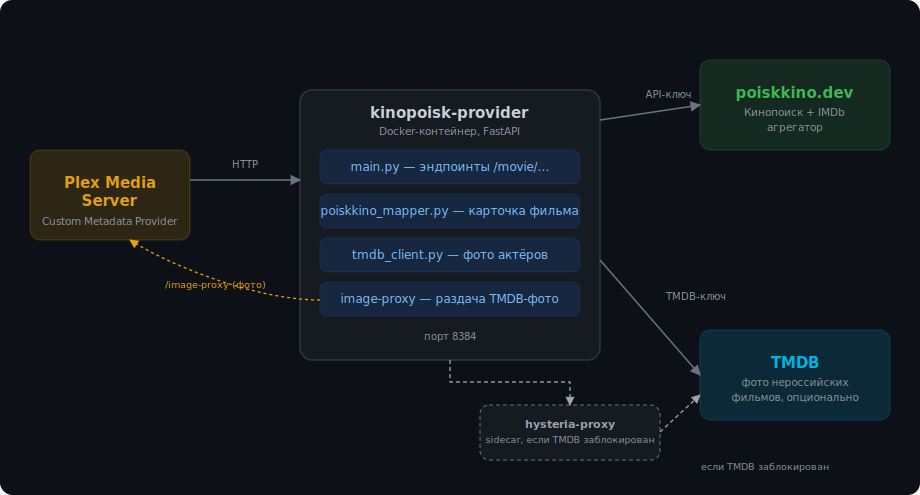

# 🎬 Kinopoisk Custom Metadata Provider для Plex

**Современный источник метаданных с Кинопоиска для Plex Media Server** — название, описание, рейтинг, полный актёрский состав, русские рецензии, коллекции и фото актёров (с TMDB для нероссийских фильмов). Замена старому `Kinopoisk.bundle`, который современный Plex больше не запускает.

Автор: **Sergey Sychev**

---

## Зачем это нужно

Plex когда-то поддерживал сторонние агенты метаданных (legacy plugins), и для Кинопоиска был отличный `Kinopoisk.bundle`. Начиная с версии PMS **1.43.0** Plex убрал старый движок плагинов совсем — старые агенты просто не запускаются. Взамен появился новый официальный механизм **Custom Metadata Providers**: обычный HTTP-сервис, который Plex дёргает сам при добавлении фильма и обновлении метаданных.

Этот проект — такой сервис для Кинопоиска, упакованный в Docker и готовый к разворачиванию на чём угодно.

## Что вы получите на карточке фильма

- Название, год, слоган, описание — **на русском**
- Рейтинги Кинопоиска и IMDb (текстом в описании — см. [FAQ](#почему-рейтинг-в-виде-текста-а-не-бейджа))
- Полный актёрский состав и съёмочная группа
- **Фото актёров с TMDB** для нероссийских фильмов (лучше качеством) — опционально
- Рецензии **на русском языке** с Кинопоиска
- Коллекции/подборки Кинопоиска ("250 лучших фильмов" и т.п.)
- Похожие фильмы

## Как это устроено



Основные данные всегда идут с Кинопоиска через **[poiskkino.dev](https://poiskkino.dev)** (агрегатор Кинопоиск + TMDb + IMDb). Фото актёров для нероссийских фильмов дополнительно ищутся на TMDB напрямую — если TMDB заблокирован в вашей сети (частая ситуация для России), есть встроенная опциональная поддержка прокси.

---

## Быстрый старт (любая платформа с Docker)

Нужен только **Docker** и **Docker Compose** — не важно, Synology это, Unraid, QNAP, обычный Linux-сервер, или Docker Desktop на Windows/Mac.

### 1. Получите API-ключ

Зарегистрируйтесь в Telegram-боте **[@poiskkinodev_bot](https://t.me/poiskkinodev_bot)** и получите бесплатный API-ключ poiskkino.dev (бесплатный тариф — 200 запросов/сутки, этого достаточно для домашней библиотеки).

### 2. Скачайте проект

```bash
git clone https://github.com/<ваш-репозиторий>/kinopoisk-provider.git
cd kinopoisk-provider
```

(Или просто скачайте и распакуйте zip-архив с релизом.)

### 3. Настройте ключи

```bash
cp docker-compose.yml.example docker-compose.yml
```

Откройте `docker-compose.yml` и впишите свой ключ:

```yaml
- POISKKINO_API_KEY=ваш_ключ_из_бота
```

Остальные переменные (`TMDB_API_KEY`, прокси) — опциональны, см. [раздел про TMDB и прокси](#фото-актёров-с-tmdb-опционально) ниже.

### 4. Запустите

```bash
docker compose up -d --build
```

Проверьте, что сервис поднялся:

```bash
curl http://localhost:8384/healthz
# {"status":"ok","version":"0.15.1","build":"2026-07-19","author":"Sergey Sychev"}
```

### 5. Подключите провайдер в Plex

1. Откройте Plex Web → **Settings → Metadata Agents**
2. **Add Provider** → укажите ссылку: `http://<IP-вашего-сервера>:8384/movie`
   *(если Plex тоже в Docker на той же машине — используйте настоящий IP машины, не `localhost`)*
3. **Add Agent** → задайте имя (например «Кинопоиск RU»)
4. Добавьте в агент **оба** провайдера: свой Kinopoisk-провайдер **первым** (Primary), и **Plex Movie** вторым (запасной источник для полей, которые Кинопоиск не покрывает)
5. Откройте нужную библиотеку → **Edit → Advanced → Agent** → выберите «Кинопоиск RU» → Save
6. Запустите **Refresh All Metadata** на библиотеке

Готово — новые и существующие фильмы начнут получать метаданные с Кинопоиска.

---

## Установка на конкретных платформах

<details>
<summary><b>🖥️ Synology (Container Manager)</b></summary>

1. Через **File Station** загрузите папку проекта на NAS, например в `/docker/kinopoisk-provider`
2. Откройте **Container Manager → Проект → Создать**
3. Название проекта: `kinopoisk-provider`, Путь: укажите загруженную папку
4. Источник: «Загрузить docker-compose.yml» — Container Manager сам найдёт файл в папке
5. На экране веб-портала ничего не включайте — не нужно
6. **Собрать** → **Пуск**
7. Проверьте `http://<IP-Synology>:8384/healthz` в браузере

При любом обновлении файлов: **Остановить → удалить старый образ в разделе «Образ» → Собрать → Пуск** — Synology иногда слишком агрессивно кэширует сборку, и без удаления образа изменения не подхватываются.

</details>

<details>
<summary><b>🐧 Unraid</b></summary>

1. Установите плагин **Compose Manager** из Community Applications (если ещё не установлен)
2. Скопируйте папку проекта в `/mnt/user/appdata/kinopoisk-provider` 
3. В Compose Manager добавьте новый стек, указав путь к папке
4. Впишите ключи в `docker-compose.yml` так же, как описано в Быстром старте

5.    
6. Запустите стек

</details>

<details>
<summary><b>📦 QNAP (Container Station)</b></summary>

1. Загрузите папку проекта через File Station
2. **Container Station → Приложения → Создать** → выберите «Создать приложение через docker-compose.yml», укажите путь к файлу
3. Запустите приложение

</details>

<details>
<summary><b>🐳 Обычный Linux-сервер / Docker Desktop (Windows, Mac)</b></summary>

Просто выполните шаги из «Быстрого старта» выше через терминал — `git clone` → `docker compose up -d --build`. Никаких платформенных особенностей нет.

</details>

---

## Фото актёров с TMDB (опционально)

Для нероссийских фильмов провайдер может искать фото актёров на TMDB (обычно лучше качеством, чем на Кинопоиске). Это полностью опционально — без настройки всё продолжит работать, просто фото возьмутся с Кинопоиска для всех фильмов.

### Если TMDB у вас не заблокирован

1. Получите бесплатный API-ключ на [themoviedb.org/settings/api](https://www.themoviedb.org/settings/api) (обычный **API Key**, не Read Access Token)
2. Впишите его в `docker-compose.yml`:
   ```yaml
   - TMDB_API_KEY=ваш_ключ_tmdb
   ```
3. Пересоберите контейнер — готово

### Если TMDB заблокирован (частая ситуация для российских сетей)

Понадобится свой VPN/прокси-сервер с протоколом **Hysteria2**. Проект включает готовый sidecar-контейнер, который сам разбирает ссылку подключения — вручную ничего парсить не нужно.

1. В `docker-compose.yml` найдите сервис `hysteria-proxy` и впишите свою ссылку целиком:
   ```yaml
   - HYSTERIA2_URL=hysteria2://AUTH@HOST:PORT/?insecure=1&sni=example.com#name
   ```
2. Задайте `PUBLIC_BASE_URL` — тот же адрес, что вы вписали в Plex как URL провайдера:
   ```yaml
   - PUBLIC_BASE_URL=http://<IP-вашего-сервера>:8384
   ```
   *(Без этого шага TMDB-фото найдутся, но не отобразятся — сам Plex скачивает картинки напрямую, в обход прокси, и упирается в ту же блокировку. `PUBLIC_BASE_URL` заставляет Plex качать картинки через наш `/image-proxy`, который сам ходит через прокси.)*
3. Пересоберите оба контейнера

---

## Переменные окружения — справочник

| Переменная | Обязательна | Описание |
|---|---|---|
| `POISKKINO_API_KEY` | ✅ Да | Ключ poiskkino.dev из `@poiskkinodev_bot` |
| `TMDB_API_KEY` | Нет | Ключ TMDB для фото актёров нероссийских фильмов |
| `HYSTERIA2_URL` | Нет | Ссылка на ваш Hysteria2-прокси, если TMDB заблокирован |
| `TMDB_PROXY_URL` | Нет | Обычно `socks5://hysteria-proxy:1080`, если используете встроенный sidecar |
| `PUBLIC_BASE_URL` | Нет* | *Обязательна, если используете TMDB через прокси* — адрес, по которому Plex достучится до контейнера |

---

## FAQ / Troubleshooting

#### Провайдер не появляется в Plex / ошибка "unsupported metadata types"
Проверьте версию PMS — нужна **1.43.0 или новее**. Также убедитесь, что ссылка в Plex указывает на `/movie` в конце (`http://IP:8384/movie`), а не просто на корень.

#### После обновления файлов ничего не изменилось
Docker закэшировал старую сборку. Остановите контейнер, удалите его образ (в Synology — раздел «Образ»; в обычном Docker — `docker rmi`), затем соберите заново.

#### Рецензии не появляются, хотя всё остальное работает
Убедитесь, что в объекте рецензии заполнено поле `tag` — без него Plex, похоже, бракует весь массив рецензий целиком и незаметно откатывается на резервный источник (Plex Movie/Rotten Tomatoes).

#### Почему рейтинг в виде текста, а не бейджа?
На момент написания (версия PMS 1.43.x) отображение рейтинга от custom-провайдеров, похоже, не полностью реализовано на стороне Plex — несколько разных вариантов схемы (`Rating[]`, плоские поля `rating`/`audienceRating`) не приводят к появлению цветного бейджа. Рейтинг с Кинопоиска и IMDb поэтому дублируется текстом в описании. Если Plex это когда-нибудь исправит — попробуйте убрать этот текстовый блок из `poiskkino_mapper.py`.

#### 500 Internal Server Error / "Неверный или отсутствующий X-API-KEY"
Проверьте `docker-compose.yml` на лишние пробелы вокруг значения ключа (частая проблема при копипасте, особенно с Windows) — сам провайдер уже обрезает пробелы автоматически (`.strip()`), но стоит перепроверить, что скопирован именно текущий, не отозванный ключ.

#### TMDB-фото не находятся вообще (`tmdb_photos_found=0`)
Проверьте лог контейнера — там печатается точная причина (неверный ключ, таймаут, блокировка). Если видите `Cannot assign requested address` или `All connection attempts failed` — TMDB заблокирован в вашей сети, нужен прокси (см. раздел выше).

#### TMDB-фото находятся, но не отображаются на карточке
Проверьте, задан ли `PUBLIC_BASE_URL` (см. выше) — без него Plex пытается скачать картинку с TMDB напрямую и не может.

#### Актёры совсем без фото (пустой кружок с инициалами)
Значит фото не нашлось ни на Кинопоиске, ни на TMDB (обычно для эпизодических ролей) — это нормально, не баг.

---

## Что дальше не реализовано (известные ограничения)

- Трейлеры — новый API Plex для custom-провайдеров пока не имеет прямого аналога "extras" из старых legacy-агентов
- Данные для сериалов — реализовано только для фильмов

## Лицензия и вклад в проект

Свободно используйте, форкайте и дорабатывайте. Если найдёте баг или улучшение — присылайте issue/pull request.

---

*Полная история изменений — [CHANGELOG.md](CHANGELOG.md)*
